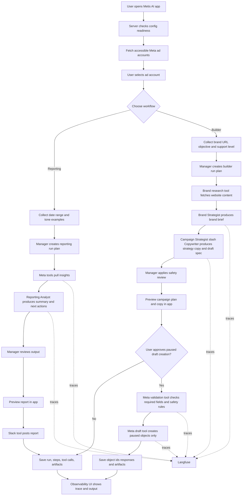

# Metis AI MaaS MVP Scoping Document

**Date:** 2026-04-25
**Primary track:** MaaS
**Product:** Metis AI
**Working title:** Meta Ads Ops Agent Team

## 1. Full Picture

### 1.1 Goal

Build a working MaaS product where a small team of AI agents helps a performance marketer operate Meta ads workflows from one control surface.

For the weekend submission, Metis AI should prove two real workflows:

1. Reporting: read real Meta ad account data, produce a useful performance summary, and send it to Slack.
2. Builder: analyze a brand, generate a campaign plan and copy, then create paused draft campaign objects in Meta without touching live campaigns.

The product should feel like an AI ops team for Meta ads, not a generic chatbot.

### 1.2 User

The first user is a performance marketer, media buyer, or agency operator who manages Meta ad accounts and wants faster planning, reporting, and launch preparation.

For this weekend, the user is the operator who already has a long-lived Meta user access token and access to active client ad accounts.

### 1.3 Core Promise

The user sees a control surface where they can select an accessible Meta ad account, choose reporting or builder mode, run the agent team, inspect exactly what happened, and receive a real output on a real surface.

Real surfaces for judging:

- Slack channel for reporting summaries and alert messages.
- Meta Ads account for paused draft campaign/ad set/ad objects.
- Internal observability screen for run trace, agent handoffs, tool calls, cost, and failures.

### 1.4 Non-Negotiable Safety Rule

No live account changes during the weekend MVP.

Allowed:

- Read ad account, campaign, ad set, ad, creative, and insights data.
- Create new paused draft campaign objects only.
- Send Slack messages.
- Store run outputs, traces, and tool responses.

Blocked:

- No updates to existing active campaigns.
- No budget increases.
- No status changes to `ACTIVE`.
- No deleting, archiving, or replacing existing Meta objects.
- No automatic optimization on live objects.
- No custom audience upload unless separately scoped and tested.

All draft-created objects must use a clear prefix:

```text
[AIW-DRAFT] Metis AI
```

### 1.5 Current Stack To Preserve

Already decided and present in the project:

- Frontend: Next.js + TypeScript
- Hosting: Vercel
- Database: Supabase/Postgres
- Existing app: waitlist landing page
- Repo: `metis-ai`

Recommended additions for the MaaS MVP:

- Agent orchestration: CrewAI, preferably via a Python worker/service
- LLM: OpenRouter via server-side calls only
- Observability: structured local run logs first, with Langfuse and/or Supabase upgrade later if time remains
- Slack integration: Slack incoming webhook for the weekend
- Meta integration: Meta Marketing API using a long-lived user token for MVP

Provider decision update on `2026-04-25 12:54:29 IST`:

- OpenRouter replaces direct OpenAI API usage as the default LLM gateway for the repo and weekend MVP.
- Prefer OpenRouter model slugs in config, starting with `openai/gpt-5.4-mini` for low-cost reporting and builder POCs.
- Reason: near-identical small top-up cash cost, wider model access for testing agents, and faster fallback across providers from one API.

Deployment reality:

- Vercel remains the user-facing app host.
- The POC can run as local Python scripts first.
- If CrewAI deployment becomes a blocker, keep the agent architecture and structured handoffs but execute the weekend MVP through server-side TypeScript orchestration. This is a fallback only; the scope should still preserve clear manager and specialist roles.

### 1.6 Auth And Token Handling

Weekend MVP:

- Use a long-lived Meta user token because it is already generated.
- Use that token to list accessible ad accounts so the user can select which account to operate on.
- Prefer storing the token as a server-side environment variable for the demo.
- If token input is exposed in UI, treat it as a password field, send it only to the server, and do not persist it in Supabase.
- Never commit the token.
- Never print the token in logs, traces, Slack, or UI.

Production direction:

- Replace long-lived user-token mode with proper Meta OAuth and/or system user token flows.
- Add account-level permissions, RBAC, refresh/revocation handling, and encrypted token storage.

### 1.7 Meta API Feasibility Boundary

Expected feasible for MVP:

- Fetch accessible ad accounts for the token user.
- Read campaigns, ad sets, ads, creatives, insights, pixels, and basic account metadata where permissions allow.
- Pull insights for a selected date range.
- Create new paused campaign objects where account permissions and objective constraints allow.
- Create draft creative/ad objects using simple text/link creative inputs.

Known limitations and risks:

- The token can only access ad accounts and business assets the token user is allowed to access.
- Client account access may require proper Meta app permissions and advanced access depending on the account relationship.
- Objective-specific campaign fields can fail validation if the generated plan does not match Meta's required schema.
- Page, Instagram account, pixel, and conversion assets may be required for realistic campaign creation.
- Audience automation depends on available source data, pixels, permissions, and policy constraints.
- Some insights queries may require async jobs for large accounts or long date ranges.

MVP posture:

- Read broadly.
- Write narrowly.
- Validate before every write.
- Create paused drafts only.

## 2. Product Surface

### 2.1 Screens

The MVP should have an app surface beyond the waitlist page.

Required screens:

- `Connect / Setup`: shows token mode, Slack webhook status, and required environment readiness.
- `Account Selector`: lists accessible Meta ad accounts and lets the user choose one.
- `Mission Control`: lets the user choose Reporting or Builder.
- `Reporting Run`: date range, tone examples, run button, output preview, Slack send result.
- `Builder Run`: brand URL, objective, support level, output preview, paused draft creation button.
- `Runs / Observability`: list of past runs with status, cost, latency, agent steps, tool calls, outputs, and errors.

Optional if time remains:

- `Eval Dashboard`: shows named eval cases and pass/fail history.

### 2.2 Primary User Flows

Flow A: Setup and account selection

1. User opens the app.
2. App confirms server has required env vars or asks for token in a password field.
3. App calls Meta to fetch accessible ad accounts.
4. User selects an ad account.
5. App stores selected account ID in run state.

Flow B: Reporting

1. User selects account and date range.
2. User optionally pastes prior messages to mimic tone.
3. System pulls campaign/ad set/ad insights.
4. Reporting Analyst creates summary, findings, and next-step notes.
5. Manager reviews output for completeness.
6. App previews report.
7. App sends report to Slack.
8. Observability captures the full trace and tool calls.

Flow C: Builder and paused draft launcher

1. User enters brand website URL.
2. User enters objective and support level.
3. Brand Strategist creates brand brief.
4. Campaign Strategist / Copywriter creates campaign structure.
5. Campaign Strategist / Copywriter creates TOF/MOF/BOF copy variants.
6. Manager validates that output is draft-safe.
7. App previews campaign plan and copy.
8. User explicitly approves paused draft creation.
9. Deterministic Meta tool creates paused draft objects only.
10. App shows created object IDs and stores all responses.

Flow D: Observability review

1. User opens a run.
2. User sees run status, selected account, flow type, timestamps, cost, latency, and final output.
3. User sees agent steps in order.
4. User sees every Meta and Slack tool call with sanitized request/response.
5. User sees failure reason if a step failed.

### 2.3 Core User Stories

These user stories are the operational backbone of the weekend MVP.

#### Setup and account access

- As a performance marketer, I want to use my existing Meta access token to see the ad accounts I can access, so I can choose the right account without hardcoded IDs.
- As a performance marketer, I want the app to keep secrets server-side, so I can test the product without leaking tokens into logs or the UI.

#### Reporting

- As a performance marketer, I want to select an ad account and date range, so I can generate a report for a real reporting window.
- As a performance marketer, I want to provide prior message examples, so the report matches my communication style.
- As a performance marketer, I want the app to send the report to Slack, so the output lands in a real channel my team already uses.

#### Builder

- As a performance marketer, I want to submit a brand URL, campaign objective, and support level, so the system can generate a relevant campaign brief.
- As a performance marketer, I want strategy and copy generated before any Meta write happens, so I can inspect the plan first.
- As a performance marketer, I want any Meta launch action to create paused drafts only, so I can safely test on live client accounts without changing active spend.

#### Observability and trust

- As a performance marketer, I want to inspect what each agent did, which tools it called, and why a run failed, so I can trust and debug the system.
- As a builder submitting to the MaaS track, I want real run traces, logs, and outputs on real surfaces, so the project scores well on real output and observability.

### 2.4 Live Flow Chart

This flow chart reflects the intended live MVP behavior, not an idealized future state.



## 3. Agent Organization

### 3.1 Exact Agent Count

Use exactly 4 agents.

1. Manager / Ops Lead Agent
2. Brand Strategist Agent
3. Campaign Strategist / Copywriter Agent
4. Reporting Analyst Agent

Reasoning:

- Four agents match the real reasoning jobs in scope.
- Meta execution and Slack delivery should be deterministic tools, not agents.
- This keeps the architecture readable for a beginner-led weekend build while still scoring well for MaaS agent organization.

### 3.2 Agent 1: Manager / Ops Lead

Responsibilities:

- Understand the user request.
- Choose Reporting or Builder flow.
- Decide which specialist agents are needed.
- Pass structured context between agents.
- Review final specialist outputs.
- Block unsafe Meta write requests.
- Create final user-visible run summary.

Inputs:

- Selected ad account.
- User mission.
- Available account assets.
- Safety policy.
- Prior run memory.

Outputs:

- `RunPlan`
- `SpecialistTask`
- `ManagerReview`
- `SafetyDecision`
- final run summary

Does not do:

- Direct Meta API calls.
- Slack posting.
- Raw token handling.
- Creative guessing beyond reviewing structured outputs.

### 3.3 Agent 2: Brand Strategist

Responsibilities:

- Analyze brand website URL.
- Extract positioning, products, categories, tone, offer, audience, differentiators, and claims.
- Identify missing information that affects campaign quality.
- Produce a structured brand brief.

Inputs:

- Brand URL.
- Objective.
- Support level.
- Optional user notes.

Outputs:

- `BrandBrief`
- `BrandRisks`
- `MissingInputs`

Does not do:

- Create Meta objects.
- Invent unsupported claims.
- Decide budgets.

### 3.4 Agent 3: Campaign Strategist / Copywriter Agent

Responsibilities:

- Create campaign strategy from brand brief and objective.
- Recommend funnel stage framing.
- Produce TOF/MOF/BOF copy options.
- Produce creative direction notes.
- Produce a draft launch structure that can be validated before Meta writes.

Inputs:

- `BrandBrief`
- objective
- support level
- selected ad account context
- available assets

Outputs:

- `CampaignPlan`
- `CopyPack`
- `DraftLaunchSpec`

Does not do:

- Execute Meta writes.
- Optimize live campaigns.
- Upload audiences.

### 3.5 Agent 4: Reporting Analyst

Responsibilities:

- Read structured insights data.
- Compare spend, delivery, CPA, CTR, CPC, conversions, ROAS if available.
- Identify outliers and simple next actions.
- Write a Slack-ready summary in the user's preferred tone.

Inputs:

- Selected ad account.
- Date range.
- Meta insights rows.
- Prior messages or tone examples.
- KPI definitions.

Outputs:

- `ReportSummary`
- `SlackReportMessage`
- `MonitoringFindings`

Does not do:

- Change campaign status.
- Change budgets.
- Claim causality where data only supports correlation.

## 4. Deterministic Tools

Agents can request tools, but tools own external effects.

### 4.1 Meta Tools

Required tools:

- `list_ad_accounts(token)`: returns accessible ad accounts.
- `get_account_assets(account_id)`: returns pages, pixels, campaigns, ad sets, ads, creatives where available.
- `get_insights(account_id, date_range, level)`: returns campaign/ad set/ad insights.
- `validate_draft_launch(spec)`: checks safety and required fields.
- `create_paused_draft(spec)`: creates paused draft objects only.

Safety requirements:

- Tool rejects any `ACTIVE` status.
- Tool rejects writes to existing object IDs.
- Tool prefixes created names with `[AIW-DRAFT]`.
- Tool stores full sanitized request/response.
- Tool returns object IDs, URLs if available, and failure reasons.

### 4.2 Slack Tools

Required tools:

- `send_slack_message(channel_or_webhook, message)`: sends reporting output or failure alert.
- `send_failure_alert(run_id, reason)`: sends a simple run failure alert.

Safety requirements:

- No access tokens in Slack messages.
- No raw PII.
- Include run ID and selected ad account name.

### 4.3 Brand Research Tools

Required tools:

- `fetch_brand_page(url)`: fetch website content.
- `extract_brand_text(html)`: extract useful visible text.

Safety requirements:

- Store fetched content and extraction output.
- Respect timeouts.
- Fail clearly if the URL cannot be fetched.

## 5. Structured Handoffs

All agent handoffs must be structured JSON or Pydantic-style schemas.

Required objects:

- `RunContext`
- `AccountContext`
- `BrandBrief`
- `CampaignPlan`
- `CopyPack`
- `DraftLaunchSpec`
- `MetaValidationResult`
- `ReportSummary`
- `SlackMessage`
- `AgentStep`
- `ToolCall`

No specialist agent should receive only a prose summary if a structured object already exists.

This is important for:

- reducing hallucination
- preserving context between agents
- scoring well on MaaS handoffs and memory
- making evals easier

## 6. Memory Design

Use three memory layers.

### 6.1 Working Memory

Per-run state:

- run ID
- selected ad account
- date range
- objective
- brand URL
- user notes
- tone examples
- current agent outputs
- approval state

Stored in Supabase and passed through the orchestrator.

### 6.2 Episodic Memory

Past task memory:

- previous reports
- previous builder runs
- previous draft launch specs
- previous Slack messages
- prior failures and resolutions

Stored in Supabase and optionally mirrored into CrewAI memory.

### 6.3 Semantic Memory

Stable domain and team knowledge:

- KPI definitions
- Meta safety rules
- naming conventions
- allowed MVP actions
- blocked actions
- preferred report style
- product decisions

Stored in version-controlled config and Supabase.

Weekend requirement:

- Supabase is the durable source of truth.
- CrewAI memory can be used for agent recall, but it cannot be the only durable memory layer.

## 7. Observability

### 7.1 Recommended Tool

Use Langfuse for LLM/agent tracing.

Reason:

- CrewAI documents Langfuse integration through OpenTelemetry/OpenLit.
- Langfuse is easier than raw OpenTelemetry for this deadline.
- The MaaS rubric is capability-based, and Langfuse helps show traces, costs, latency, and step visibility quickly.

POC decision update on `2026-04-25 13:57:57 IST`:

- do not spend remaining POC time integrating Langfuse or Supabase observability infrastructure first
- use structured local JSONL run logs as the active observability path for the current POC phase
- preserve the same run concepts: run ID, agent steps, tool calls, artifacts, status, timestamps
- keep Langfuse and/or Supabase as a later upgrade path only if the higher-priority POCs are already passing

### 7.2 Internal Observability

For the current POC phase, internal observability should use structured local run logs written to disk first.

Required tables/concepts:

- `maas_runs`
- `agent_steps`
- `tool_calls`
- `run_artifacts`
- `eval_cases`
- `eval_results`

POC implementation equivalent:

- one JSONL log file with one event per run
- each event contains the same business concepts that would later map to DB tables
- no secrets in the log file
- log path should stay local to the repo

Required UI capabilities for L4 observability target:

- open a specific run
- see trace tree across agents
- see tool calls
- see token/cost/latency if available
- filter by agent, flow, status, or account
- see failures and Slack alerts

Stretch for L5:

- compare two runs side by side
- alert on cost spike
- search across runs

### 7.3 What Must Never Be Logged

- Meta access token
- OpenRouter API key
- Langfuse secret key
- Supabase service role key
- Slack webhook URL

Sanitize before saving:

- authorization headers
- access token query params
- cookies
- raw webhook URLs

## 8. Evaluation Plan

Goal:

Reach at least L3 evaluation and leave a clear path to L4.

Named eval set:

- 4 reporting evals
- 4 builder evals
- 2 safety evals

Minimum eval checks:

- Reporting output includes executive summary, what changed, risks, and next actions.
- Reporting output does not invent metrics missing from the input.
- Builder output includes brand brief, strategy, copy pack, and draft launch spec.
- Draft launch spec never requests `ACTIVE` status.
- Draft launch spec never updates existing active object IDs.
- Slack message is concise and readable.
- Token/secrets are absent from all outputs.

Execution:

- POC can run evals manually from scripts.
- Full build should expose eval runs in the internal UI if time allows.
- Prompt and schema changes should be versioned in the repo.

## 9. Data Model Draft

Use Supabase/Postgres as the source of truth.

Core tables:

### `maas_runs`

- `id`
- `flow_type`: `reporting` or `builder`
- `status`: `queued`, `running`, `needs_approval`, `succeeded`, `failed`
- `selected_account_id`
- `selected_account_name`
- `input_payload`
- `final_output`
- `cost_usd`
- `latency_ms`
- `created_at`
- `updated_at`

### `agent_steps`

- `id`
- `run_id`
- `agent_name`
- `task_name`
- `input_payload`
- `output_payload`
- `status`
- `started_at`
- `finished_at`
- `latency_ms`
- `langfuse_trace_id`

### `tool_calls`

- `id`
- `run_id`
- `agent_step_id`
- `tool_name`
- `sanitized_request`
- `sanitized_response`
- `status`
- `error_message`
- `started_at`
- `finished_at`

### `run_artifacts`

- `id`
- `run_id`
- `artifact_type`
- `title`
- `payload`
- `created_at`

### `eval_cases`

- `id`
- `name`
- `flow_type`
- `input_payload`
- `expected_checks`
- `created_at`

### `eval_results`

- `id`
- `eval_case_id`
- `run_id`
- `status`
- `check_results`
- `created_at`

## 10. MaaS Rubric Target

Primary scoring target:

- Real output: L4, stretch L5
- Agent org structure: L4
- Observability: L4
- Evaluation and iteration: L3, stretch L4
- Handoffs and memory: L4
- Cost and latency: L3
- Management UI: L3

How the MVP supports this:

- Real output: Slack report and paused Meta draft objects on real surfaces.
- Agent org: manager plus specialist agents with structured handoffs.
- Observability: Langfuse traces plus internal run viewer.
- Evals: named eval set with repeatable checks.
- Memory: working, episodic, and semantic memory stored durably.
- UI: non-engineer can run reporting or builder flow from the app.

## 11. Weekend MVP Scope

Must build:

- Account selector from Meta token.
- Reporting run with real insights pull.
- Slack report delivery.
- Builder run from brand URL, objective, and support level.
- Campaign plan and copy pack generation.
- Paused draft launch validation.
- Paused draft object creation if POC confirms required assets are available.
- Run logging to Supabase.
- Langfuse tracing.
- Basic observability UI.
- Named eval cases.

Should build if time allows:

- Failure Slack alerts.
- Run comparison.
- Cost spike alert.
- Read-only asset inventory screen.
- One-click export of report/campaign plan.

Out of scope for weekend:

- Live campaign optimization.
- Updating active campaigns.
- Budget increases.
- Custom audience uploads.
- OAuth multi-user production auth.
- Billing.
- Full RBAC.
- Multi-workspace agency admin.

## 12. POC Plan Boundary

The next step is not the full app build.

The POC should prove the riskiest assumptions with small backend-only scripts or minimal routes:

1. Meta token can list accessible ad accounts.
2. Selected ad account can return insights for a date range.
3. Brand URL can be fetched and converted into a useful brand brief.
4. Agents can produce structured handoffs for reporting and builder flows.
5. Slack webhook can receive a clean report message.
6. Meta can create paused draft objects without touching live campaigns, or we document the missing asset/permission blocker.
7. Langfuse captures at least one multi-agent trace.
8. Supabase stores run, agent step, tool call, and artifact records.

POC success means:

- We know which Meta permissions/assets are actually available.
- We know whether paused draft creation is feasible on the test account.
- We have one real reporting output in Slack.
- We have one visible trace.
- We have enough confidence to build the product UI around the validated flows.

## 13. Acceptance Criteria For Full MVP

The MVP is ready to submit when:

- User can select an accessible Meta ad account.
- User can run a reporting flow from real Meta data.
- User can send the report to Slack.
- User can run a builder flow from brand URL and objective.
- User can preview strategy and copy before any write.
- System can create only paused draft Meta objects, if required assets exist.
- Existing live campaigns are never modified.
- Every run is saved in Supabase.
- Every agent step and tool call is inspectable.
- Langfuse shows a trace for at least one successful run.
- Eval cases exist and can be run manually.
- Secrets are absent from logs, traces, database records, and UI.

## 14. Open Decisions Before POC

Decision 1: Token mode for weekend demo

- Recommended: server-side `META_ACCESS_TOKEN` env var for the primary demo.
- Optional: temporary password-field token input for local/manual testing only.

Decision 2: Slack mode

- Recommended: single `SLACK_WEBHOOK_URL` env var.

Decision 3: First test account

- Use one active client account only after confirming draft-only safety.
- First POC should read account data before attempting any paused draft creation.

Decision 4: Campaign objective for first draft test

- Choose one simple objective first.
- Avoid complex conversion-objective setup until account assets are confirmed.

## 15. Source Notes

Local project context:

- `docs/plan_context_first.md`
- `docs/build process.md`
- `handbook/09-scoring.md`

External docs checked for this scope:

- CrewAI Langfuse integration: `https://docs.crewai.com/en/observability/langfuse`
- CrewAI tracing: `https://docs.crewai.com/en/observability`
- CrewAI hierarchical process: `https://docs.crewai.com/en/learn/hierarchical-process`
- CrewAI memory: `https://docs.crewai.com/en/concepts/memory`
- Meta Marketing API official workspace: `https://www.postman.com/meta/facebook-marketing-api/overview`
